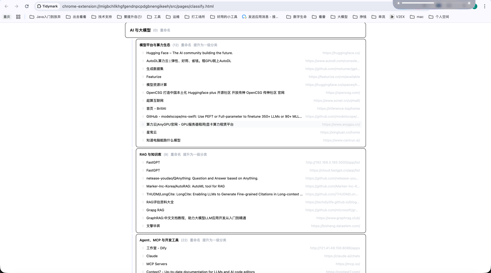
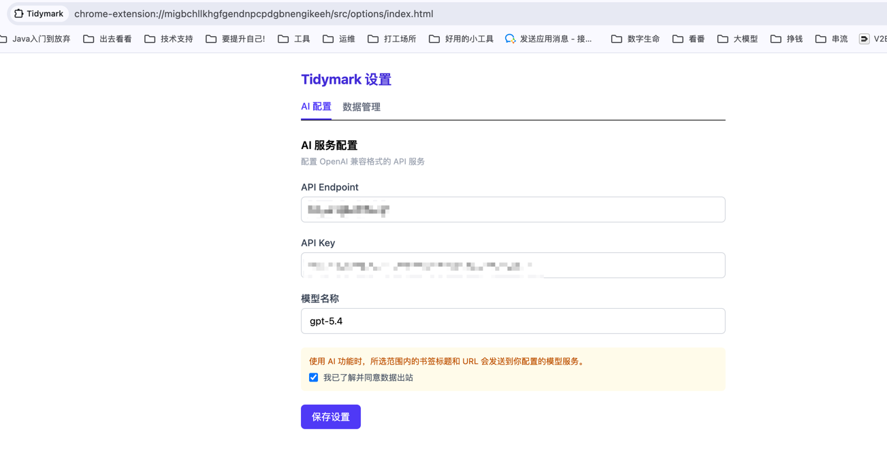
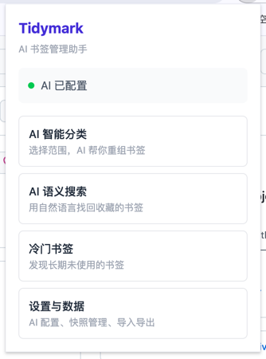
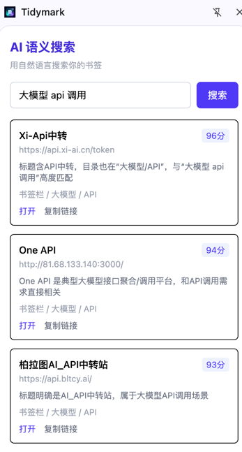

# Tidymark

<p align="center">
  
</p>

<p align="center">
  AI 驱动的 Chrome 书签管理扩展
</p>

Tidymark 是一个面向重度书签用户的 Chrome 扩展，目标是解决“收藏了很多网站，但后续找不到、用不上、忘记了”的问题。

当前产品围绕三条主线展开：
- AI 智能分类：对用户选定范围内的书签进行重组，支持最多两级分类
- AI 语义搜索：在浏览器侧边栏中用自然语言找回已收藏书签
- 冷门书签识别：找出长期未再次使用的书签并支持清理

## 界面预览

### 主功能界面



### 配置界面



### 轻入口 Popup



### AI 搜索侧边栏



## 界面形态

Tidymark 采用分工明确的扩展界面结构：
- `popup`：轻入口，只做导航和状态摘要
- `side panel`：承载 AI 搜索
- 完整页面：承载分类结果编辑页和冷门书签页
- `options page`：承载设置、导入导出和快照管理

## 核心能力

### 1. AI 智能分类

- 用户手动选择整理范围，可选单个文件夹、多个文件夹或全部书签
- AI 先生成分类结构，再将书签归类
- 分类结果支持直接编辑，包括拖拽、重命名、合并分类和调整子分类
- MVP 最多支持两级分类结构
- 应用前必须二次确认，并在写入前生成快照

### 2. AI 语义搜索

- 搜索范围仅限已收藏书签
- 本地先基于标题、URL、文件夹名做粗筛
- AI 再对候选结果进行语义排序和理由生成
- 搜索结果支持打开书签、复制链接、定位到所在文件夹
- 该能力定位为“找书签”，不是通用聊天助手

### 3. 冷门书签识别

- 基于 `dateAdded` 和 `dateLastUsed`
- `dateLastUsed` 缺失视为“收藏后从未再次使用”
- 默认优先展示从未再次使用的书签，再按最后使用时间升序排列
- 支持从未再次使用、超过 30/90/180 天未使用等筛选
- 批量删除前统一走快照和二次确认

### 4. 数据与恢复

- 所有数据默认本地存储
- 支持导出为单个 JSON 文件
- 导出文件包含 `schemaVersion`
- 导入恢复包含书签目录结构，不只是插件配置
- 快照默认保留最近 10 份，超过上限自动淘汰最旧快照

## 怎么使用

### 第一次使用

1. 打开扩展的 `Options` 页面。
2. 配置你的 `API Endpoint`、`API Key` 和模型名称。
3. 阅读并确认 AI 数据出站说明。
4. 回到 `popup`，选择你要使用的功能入口。

### 使用 AI 智能分类

1. 在 `popup` 中进入分类整理页面。
2. 选择本次要整理的书签范围。
3. 等待 AI 生成分类结果。
4. 在分类结果编辑页中调整一级分类和子分类。
5. 确认无误后应用变更。

### 使用 AI 搜索

1. 在 `popup` 中打开 AI 搜索侧边栏。
2. 用自然语言描述你要找的书签。
3. 从结果中直接打开、复制链接或定位到原文件夹。

### 使用冷门书签清理

1. 在 `popup` 中进入冷门书签页。
2. 按“从未再次使用”或“超过 30/90/180 天未使用”等条件筛选。
3. 批量选择要清理的书签。
4. 确认提示后执行删除。

### 使用导入导出与回滚

1. 打开 `Options` 页面。
2. 在数据管理区域导出当前配置、快照和书签结构。
3. 需要迁移或恢复时，导入 JSON 文件。
4. 需要撤销高风险操作时，从快照列表中选择目标版本回滚。

## 技术栈

- Chrome Extension Manifest V3
- React 19
- TypeScript
- Vite
- `@crxjs/vite-plugin`
- Tailwind CSS 4

## 项目结构

```text
src/
  background/   # service worker 与业务编排
  popup/        # popup 入口
  sidepanel/    # AI 搜索侧边栏
  pages/        # 分类编辑页、冷门书签页
  options/      # 设置、导入导出、快照管理
  ai/           # AI 调用与 prompt 组织
  storage/      # 本地存储、快照、导入导出
  bookmarks/    # Chrome bookmarks 封装
  shared/       # 共享组件、消息、样式、工具
  types/        # 全局类型
docs/
  agent_teams.md
```

## 文档入口

- [tidymark.md](./tidymark.md)：主 PRD，定义产品边界和关键决策
- [prd_breakdown.md](./prd_breakdown.md)：功能、页面、技术拆分稿
- [docs_navigation.md](./docs_navigation.md)：文档导航
- [docs/agent_teams.md](./docs/agent_teams.md)：面向多 agent 协作的开发方案

## 本地开发

```bash
npm install
npm run dev
```

开发模式下会持续构建到 `dist/`。

常用命令：

```bash
npm run build
npm run preview
```

## 添加到浏览器扩展

### 开发环境加载

1. 在项目根目录执行：

```bash
npm install
npm run build
```

2. 打开 Chrome，进入 `chrome://extensions/`。
3. 打开右上角的“开发者模式”。
4. 点击“加载已解压的扩展程序”。
5. 选择项目里的 [dist](/Users/lovegakki/workspace/myself/codespace/web/Tidymark/dist) 目录。
6. 加载完成后，把 Tidymark 固定到工具栏，方便打开 `popup`。

### 开发时更新

- 如果你在跑 `npm run dev`，修改代码后会重新构建到 `dist/`
- 回到 `chrome://extensions/` 页面，点击 Tidymark 卡片上的刷新按钮即可重新加载最新版本

## 当前约束

- 高风险操作必须二次确认
- 高风险写操作前必须先生成快照
- AI 分类只作用于用户选定范围
- AI 搜索默认通过 `side panel` 承载
- AI 服务由用户自行配置，首次使用前必须明确确认数据出站
